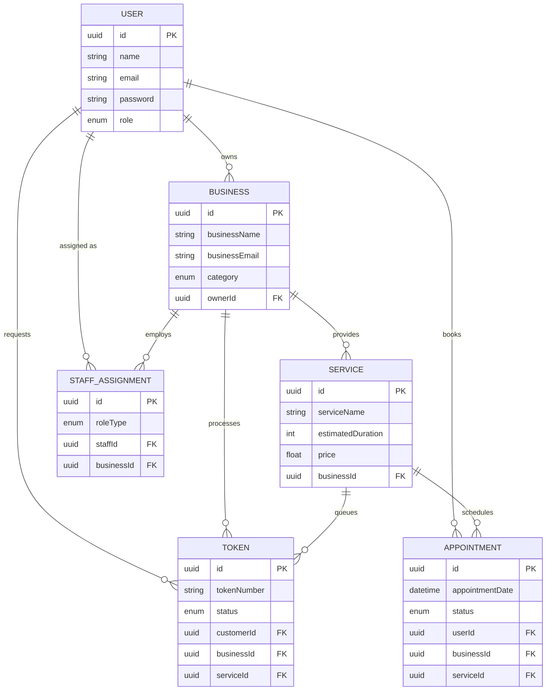

# System Architecture

QueueWISE is designed as a modular, monolithic-repository system featuring three distinct functional layers. This document outlines the system architecture, data flow, and database design.

---

## 1. System Components

### Frontend Client (`queueOS-frontend`)
- **Technology**: React 18, Vite, Tailwind CSS.
- **Role**: A Single Page Application (SPA) serving four distinct user roles (Customer, Staff, Owner, Admin) through dynamic routing.
- **State & Real-Time**: Uses `Socket.io-client` for persistent, bi-directional communication with the backend, allowing users to see their queue position update in real-time without polling.

### Backend Server (`queueOS-backend`)
- **Technology**: Node.js, Express, Prisma (ORM), Socket.io.
- **Role**: The core business logic layer. Handles REST API requests, authentication (JWT + httpOnly cookies), and broadcasts real-time socket events.
- **Background Processing**: Uses **BullMQ** backed by **Redis** to offload asynchronous tasks like push notifications and data archiving, ensuring the main HTTP thread remains unblocked.

### Machine Learning Service (`queueOS-ml`)
- **Technology**: Python, FastAPI, Scikit-Learn.
- **Role**: An isolated microservice responsible solely for predicting queue wait times.
- **Integration**: The Node.js backend communicates with this service internally via HTTP POST requests whenever a complex wait-time estimation is required.

---

## 2. Data Flow & Event Driven Architecture

QueueWISE relies heavily on event-driven architecture to keep clients in sync.

### Token Generation Flow
1. **Client** requests a new token via `POST /api/queue/token`.
2. **Backend** validates the request, generates a unique token sequence, and saves it to PostgreSQL.
3. **Backend** queries the **ML Service** to estimate the wait time.
4. **Backend** triggers an event via `Socket.io` to the specific `businessId:serviceId` room.
5. All connected **Clients** in that room instantly receive the new queue state and update their UI.

### Notification Flow (BullMQ)
1. When a token is "Called" by a staff member, the backend immediately returns a success response to the staff member.
2. Simultaneously, a `token-called` job is pushed to the **Redis Queue**.
3. The **Notification Worker** picks up the job, formats the message, creates a notification record in PostgreSQL, and could trigger external SMS/Email APIs if configured.

---

## 3. Database Schema (Prisma)

The PostgreSQL database is managed via Prisma ORM. Below is the Entity-Relationship mapping for the core domain models.

### Entity-Relationship Diagram

---

## 4. Security & Authentication

- **Access Tokens**: Short-lived (15m) JWTs stored in memory (React State) used for `Authorization: Bearer <token>` headers.
- **Refresh Tokens**: Long-lived (7 days) cryptographically random tokens stored in a secure, `httpOnly`, `sameSite=strict` cookie. Defends against XSS and CSRF attacks.
- **Role Guards**: Express middleware validates the decoded JWT role against the required endpoint permissions (e.g., only `owner` can create a `Service`).
